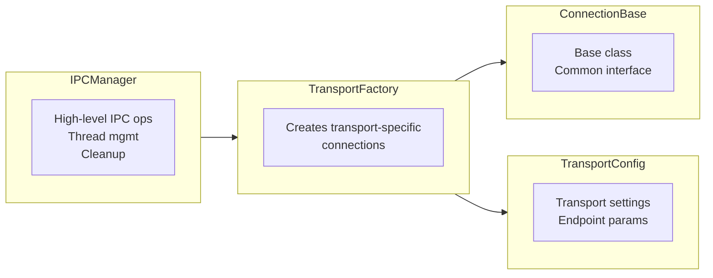

# IPC Transport Architecture

This document describes the current IPC transport architecture used for
adapter-to-launcher communication in subprocess mode.

## Overview

The legacy monolithic `IPCContext` implementation has been replaced by a
three-layer design:

- `IPCManager` owns lifecycle, reader-thread orchestration, and cleanup.
- `TransportFactory` resolves the requested transport and creates listeners or
    client connections.
- `ConnectionBase` defines the async read/write/accept/close contract for each
    transport implementation.

IPC in subprocess mode always uses binary framing over a local transport.
The transport defaults are platform-specific:

- Windows defaults to named pipes.
- POSIX defaults to Unix-domain sockets when `AF_UNIX` is available.
- TCP is the cross-platform fallback and explicit override.

## Architecture

The architecture follows the Factory pattern with clear separation of concerns:



## Key Components

### 1. TransportFactory
**Purpose**: Creates transport-specific connections using the Factory pattern.

**Responsibilities**:
- Transport type resolution (`auto`, `pipe`, `unix`, `tcp`)
- Platform-specific default selection
- Listener/client creation
- Unix-to-TCP fallback when `AF_UNIX` is unavailable
- Low-level socket helpers for synchronous and asynchronous callers

**Key Methods**:
```python
@staticmethod
def create_listener(config: TransportConfig) -> tuple[ConnectionBase, list[str]]
        # Create a listener and return launcher args such as
        # --ipc tcp --ipc-host 127.0.0.1 --ipc-port <ephemeral-port>

@staticmethod
def create_connection(config: TransportConfig) -> ConnectionBase
        # Create a client connection to an existing endpoint
```

Current transport behavior:

- TCP listeners bind to loopback by default and use port `0` so the OS assigns
    an ephemeral port.
- The resolved TCP host/port pair is returned in launcher args, avoiding stale
    fixed-port assumptions.
- `TCPServerConnection` warns when asked to bind to a non-loopback host because
    the debug adapter exposes code-execution capabilities.
- Unix-socket listener creation falls back to TCP only when Unix sockets are
    unavailable or listener setup fails.

### 2. IPCManager
**Purpose**: High-level IPC management with clean interface.

**Responsibilities**:
- Connection lifecycle management
- Reader-thread management
- Message dispatch coordination
- Synchronous and asynchronous cleanup

**Key Methods**:
```python
def create_listener(config: TransportConfig) -> list[str]
    # Create listener using the factory and return launcher args

def connect(config: TransportConfig) -> None
    # Connect to an existing endpoint

def start_reader(message_handler: Callable, accept: bool = True) -> None
    # Start a daemon reader thread; listeners typically use accept=True

async def send_message(message: dict[str, Any]) -> None
    # Write a binary-framed message through the active connection

def cleanup() -> None
async def acleanup() -> None
    # Close connection and reset manager state
```

Current cleanup behavior matters for TCP-backed sessions: when `cleanup()` runs
inside an already-running event loop, it schedules the async `close()` on that
loop and waits for completion before dropping the connection reference. This
avoids races where sockets were nulled out before the actual close finished.

### 3. TransportConfig
**Purpose**: Configuration dataclass for transport settings. The current
implementation lives in `dapper/ipc/transport_factory.py` and is used by both
`IPCManager` and launcher-facing code.

**Fields**:
```python
@dataclass
class TransportConfig:
    transport: str = "auto"
    host: str | None = None
    port: int | None = None
    path: str | None = None
    pipe_name: str | None = None
```

### 4. ConnectionBase
**Purpose**: Abstract base class for all connection types.

**Interface**:
```python
class ConnectionBase(ABC):
    async def accept() -> None
    async def close() -> None
    async def read_message() -> dict[str, Any] | None
    async def write_message(message: dict[str, Any]) -> None
```

The TCP implementation also exposes a few transport-specific behaviors that are
now relied on by tests and callers:

- `start_listening()` binds the server without blocking on a client.
- `wait_for_client()` waits for the first client and raises if called before
    listening starts.
- `accept()` composes those two steps for the normal listener flow.

### Using with DapperConfig Integration

```python
from dapper.config import DapperConfig
from dapper.ipc import IPCManager, TransportConfig

# Get configuration
config = DapperConfig.from_launch_request(request)

# Create transport config from DapperConfig
transport_config = TransportConfig(
    transport=config.ipc.transport,
    pipe_name=config.ipc.pipe_name,
    host=config.ipc.host,
    port=config.ipc.port,
    path=config.ipc.path,
)

# Use with IPC manager
manager = IPCManager()
args = manager.create_listener(transport_config)
```

## Testing Strategy

### Unit Tests
- Test TransportFactory with different configurations
- Test IPCManager lifecycle methods
- Test individual connection types
- Test TCP listener socket creation and ephemeral-port propagation
- Test `wait_for_client()` sequencing and timeout behavior
- Test non-loopback TCP security warnings
- Test error handling and fallbacks

### Integration Tests  
- Test end-to-end connection scenarios

## Performance Considerations

### Lazy Initialization
- Connections created only when needed
- Reader thread started only during active sessions
- Resources cleaned up promptly

### Memory Management
- Clear ownership of resources
- Proper cleanup in all scenarios
- No resource leaks

### Threading
- Single reader thread per IPC session
- Thread-safe state management
- Proper thread lifecycle

### Transport Selection
- TCP uses OS-assigned ephemeral ports by default to avoid fixed-port races.
- Unix sockets remain the preferred POSIX transport when available.
- Named pipes remain the preferred Windows transport.

## Future Enhancements

### 1. **Additional Transports**
- WebSocket transport for web-based debugging
- Shared memory transport for same-machine performance
- Custom transport plugins

### 2. **Advanced Features**
- Connection pooling
- Automatic reconnection
- Performance monitoring
- Connection health checks

### 3. **Security**
- Transport encryption
- Authentication mechanisms
- Secure channel establishment

## Conclusion

The IPC layer is now centered on `IPCManager`, `TransportFactory`, and async
`ConnectionBase` implementations, with binary framing and local transports as
the default operating model. Following the recent TCP fixes, the important
runtime guarantees are that TCP listeners prefer loopback, use ephemeral ports
by default, surface the resolved endpoint in launcher args, and close cleanly
without leaving stale socket state behind.
