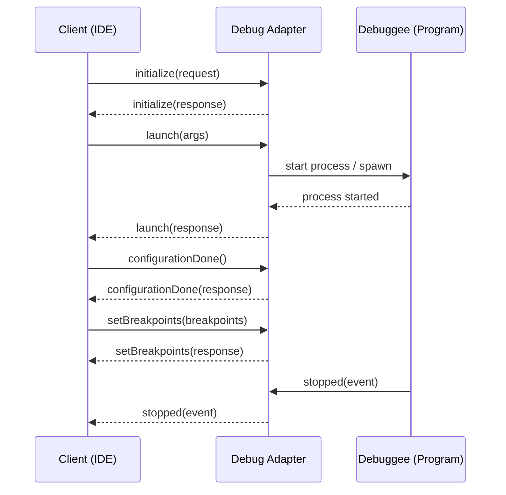
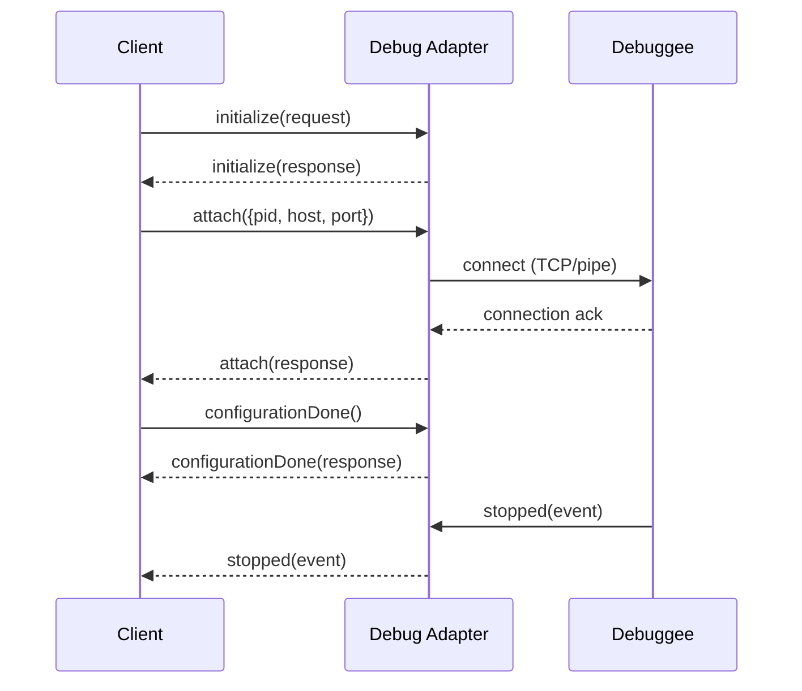
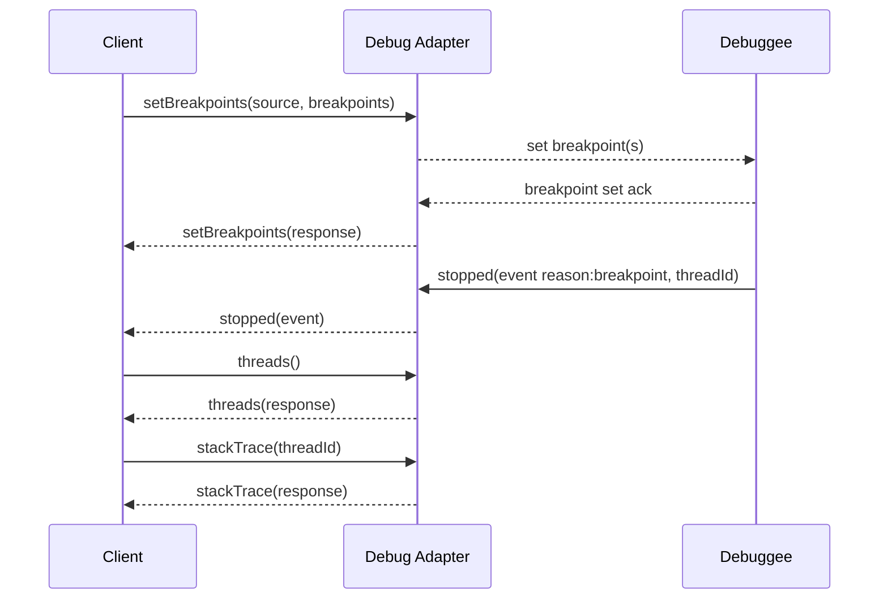

# DAP Message Flow Diagrams

This document shows common DAP (Debug Adapter Protocol) message flows as Mermaid sequence diagrams.

## 1) Launch (local) flow

A typical "launch" where an editor (DAP client) requests the adapter to launch the debuggee and initializes a debug session.




## 2) Attach flow

When the adapter attaches to an existing process (attach mode).




## 3) Set breakpoint / Hit breakpoint / Stack Trace

Illustrates setting a breakpoint then the debuggee hitting it and the client requesting a stack trace.




---

## 4) Session configuration and lifecycle

This diagram shows the full session lifecycle: initialization, launch/attach, configuration, event flow, inspection (threads/stack/scopes/variables), stepping and disconnect.


```mermaid
sequenceDiagram
    participant Editor as Client (IDE)
    participant Adapter as Debug Adapter
    participant Debuggee as Debuggee

    Note over Editor,Adapter: Session initialization & configuration
    Editor->>Adapter: initialize(request)
    Adapter-->>Editor: initialize(response)

    Note over Editor: Client capabilities negotiation
    Editor->>Adapter: setCapabilities(capabilities)
    Adapter-->>Editor: capabilitiesAck

    Note over Editor,Adapter: Launch or Attach
    alt Launch
        Editor->>Adapter: launch(args)
        Adapter->>Debuggee: spawn/start process
        Debuggee-->>Adapter: process started
    else Attach
        Editor->>Adapter: attach({pid,host,port})
        Adapter->>Debuggee: connect (TCP/pipe)
        Debuggee-->>Adapter: connection ack
    end

    Note over Editor,Adapter: Configure breakpoints and other settings
    Editor->>Adapter: setBreakpoints(source, breakpoints)
    Adapter-->>Editor: setBreakpoints(response)
    Editor->>Adapter: setExceptionBreakpoints(filters)
    Adapter-->>Editor: setExceptionBreakpoints(response)
    Editor->>Adapter: configurationDone()
    Adapter-->>Editor: configurationDone(response)

    Note over Debuggee,Adapter: Program runs; events flow
    Debuggee->>Adapter: output(event)
    Adapter-->>Editor: output(event)
    Debuggee->>Adapter: stopped(event)
    Adapter-->>Editor: stopped(event)

    Note over Editor,Adapter: User inspects state
    Editor->>Adapter: threads()
    Adapter-->>Editor: threads(response)
    Editor->>Adapter: stackTrace(threadId)
    Adapter-->>Editor: stackTrace(response)
    Editor->>Adapter: scopes(frameId)
    Adapter-->>Editor: scopes(response)
    Editor->>Adapter: variables(variablesReference)
    Adapter-->>Editor: variables(response)

    Note over Editor,Adapter: Control flow (step/continue/terminate)
    Editor->>Adapter: continue(threadId)
    Adapter-->>Debuggee: resume
    Debuggee-->>Adapter: resumed
    Adapter-->>Editor: continue(response)

    Editor->>Adapter: next/stepIn/stepOut(threadId)
    Adapter-->>Debuggee: perform step
    Debuggee-->>Adapter: stopped(event)
    Adapter-->>Editor: stopped(event)

    Editor->>Adapter: disconnect(restart=false)
    Adapter->>Debuggee: terminate/cleanup
    Adapter-->>Editor: disconnect(response)
```
