# Debug Adapter: Operational Modes (diagrams)

This reference page consolidates the adapter operational diagrams that show Launch, Attach and In-Process modes, IPC transports, message flows, backend-selection and threading models.

---

## 1. Launch Mode Architecture

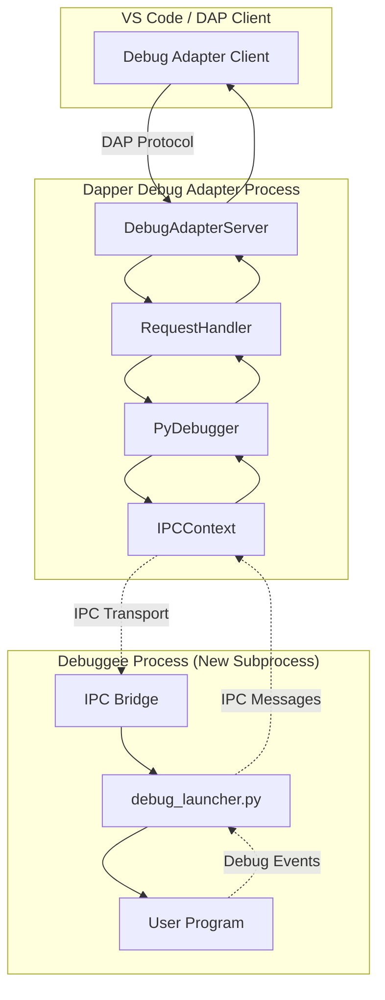

### Launch Mode Flow

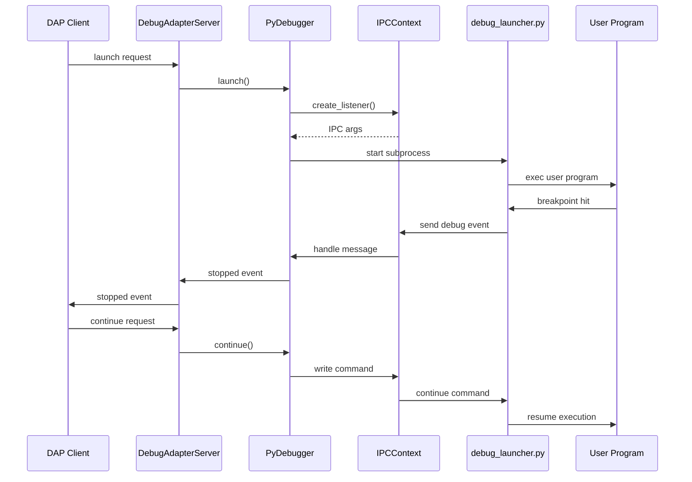

---

## 2. Attach Mode Architecture

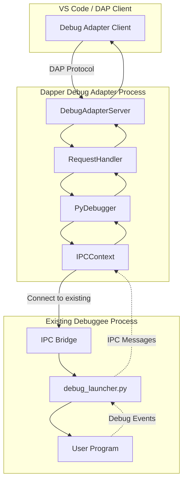

### Attach Mode Flow

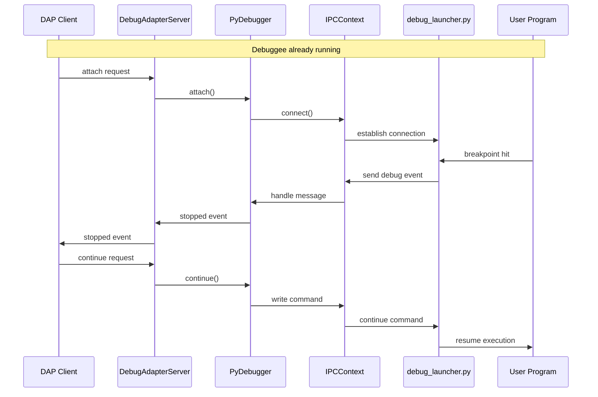

---

## 3. In-Process Mode Architecture

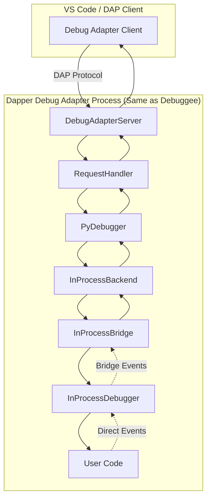

### In-Process Mode Flow

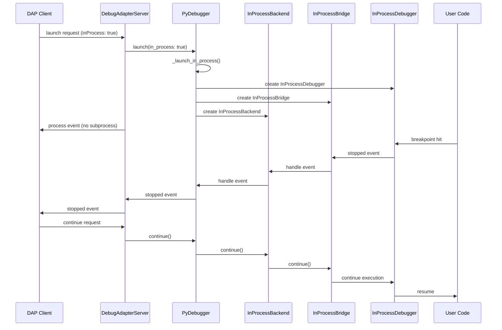

---

## 4. IPC Transport Mechanisms

### Windows Named Pipes

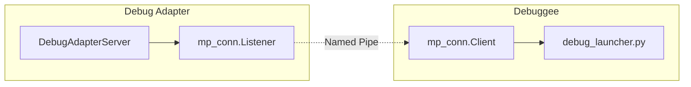

### Unix Domain Sockets

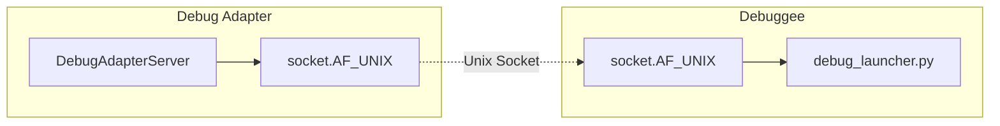

### TCP Sockets

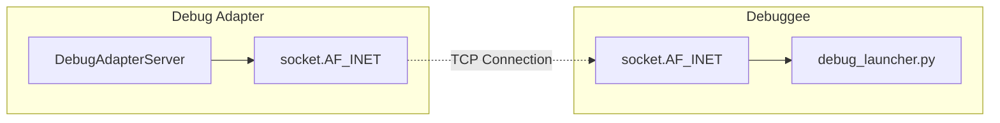

---

## 5. Message Flow Patterns

### Binary vs Text Protocol

```mermaid
graph TB
    subgraph "Binary Protocol"
        Binary[Binary Frame]
        Magic[MAGIC: "DP"]
        Ver[VERSION: 1]
        Kind[KIND: 1=event, 2=command]
        Len[LENGTH: 4 bytes]
        Payload[Payload Data]
        
        Binary --> Magic
        Magic --> Ver
        Ver --> Kind
        Kind --> Len
        Len --> Payload
    end
    
    subgraph "Text Protocol"
        Text[Text Line]
        Prefix["DBGP: "]
        JSON[JSON Message]
        
        Text --> Prefix
        Prefix --> JSON
    end
```

### Request-Response Pattern

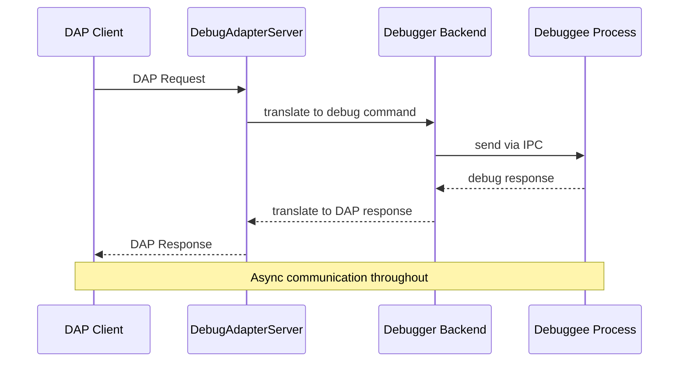

---

## 6. Backend Selection Logic

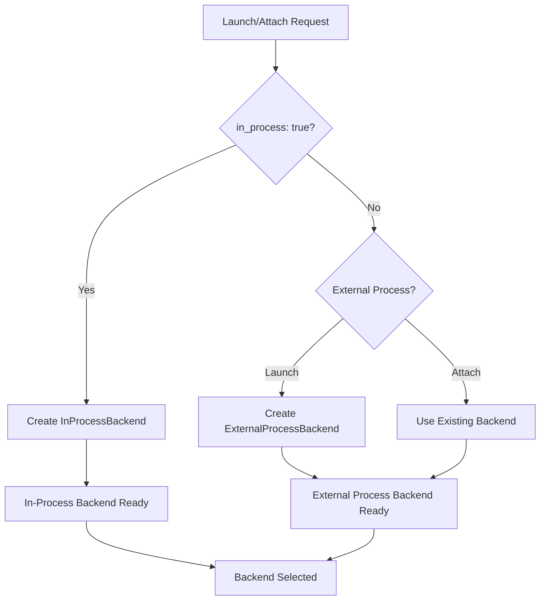

---

## 7. Error Handling and Cleanup

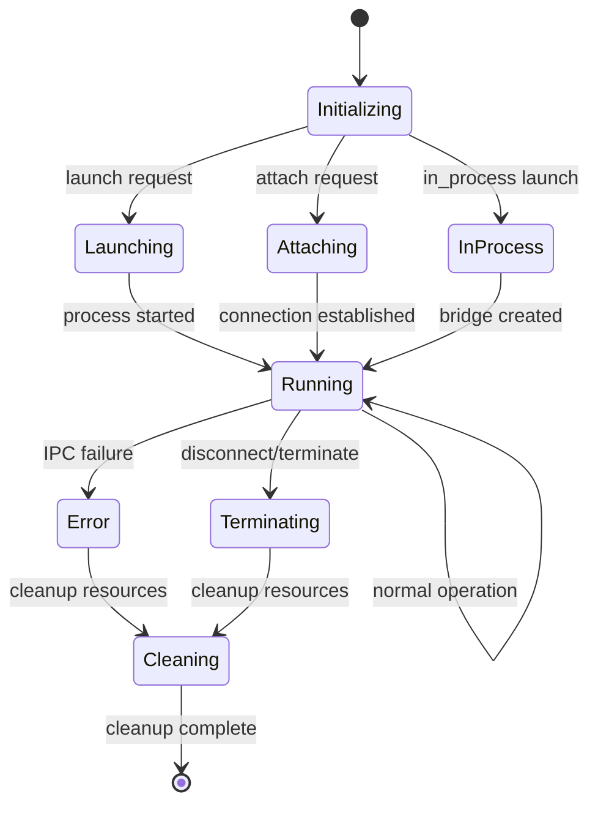

---

## 8. Configuration Matrix

| Mode | IPC Required | Subprocess | Backend Type | Use Case |
|------|--------------|------------|--------------|----------|
| Launch (Default) | Yes | Yes | ExternalProcessBackend | Standard debugging |
| Launch (inProcess) | No | No | InProcessBackend | Embedded debugging |
| Attach | Yes | No | ExternalProcessBackend | Connect to existing |
| No Debug | No | Yes | None | Run without debugging |

---

## 9. Threading Model

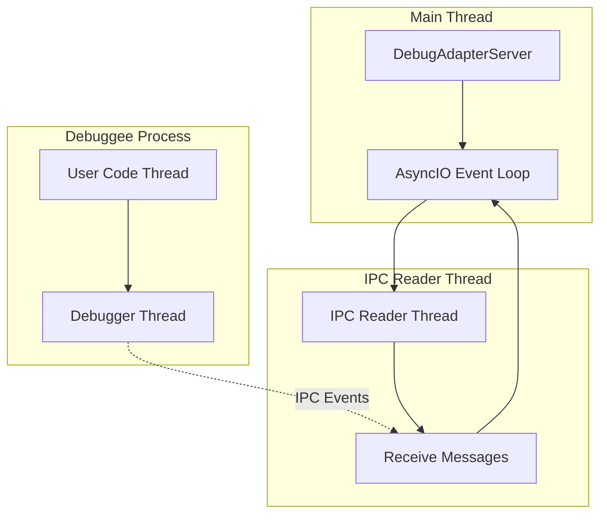
